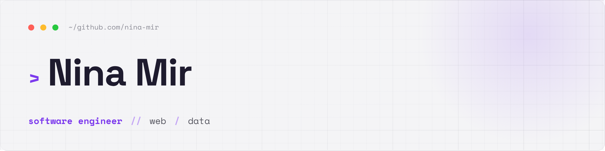

<!-- Icons: Lucide via Iconify (accent #8957e5) · banners: assets/*.png · renders on GitHub -->

  

##  &nbsp;August 2026

**`mdn/browser-compat-data`** &nbsp;[#30171](https://github.com/mdn/browser-compat-data/pull/30171) &nbsp;

Corrected Firefox compat data for `FontFaceSet.values() / .keys() / .entries()`. Tested 11 iteration behaviors across Firefox 153 and Chrome 151 to establish which three subfeatures are broken and which work correctly — a distinction the original report never made.

   

 

**`python-visualization/folium`** &nbsp;[#2263](https://github.com/python-visualization/folium/pull/2263) &nbsp;

Root-caused and fixed [issue #1520](https://github.com/python-visualization/folium/issues/1520) (open since 2021): GeoJSON tooltips/popups came up empty on multi-geometry features because `feature` never reached the child layers Leaflet wraps in a `FeatureGroup`. Fix verified against all eight geometry types plus nested `GeometryCollection`s, with a Selenium regression test.

    

 

**`traceroot-ai/traceroot`** &nbsp;[#1968](https://github.com/traceroot-ai/traceroot/pull/1968) &nbsp;

Rewrote the Vercel AI integration docs for AI SDK v7, fixing [issue #1966](https://github.com/traceroot-ai/traceroot/issues/1966), which I filed. The page documented `experimental_telemetry`, which on `ai` 7.x emits nothing — silently, with no error. Running the page's own example unmodified produced 1 span; changing only the telemetry line to `@ai-sdk/otel` produced 5, including the `chat` LLM span and the `execute_tool` span the page's own "What Gets Captured" table promises.

   

 

**`jupyterlab/jupyterlab`** &nbsp;[#19257](https://github.com/jupyterlab/jupyterlab/pull/19257) &nbsp; &nbsp;

Fixed the low-contrast variable names in the Debugger Variables panel, open since 2023. A CodeMirror syntax token was styling UI chrome text at 2.43:1 — below even the 3:1 large-text floor of WCAG SC 1.4.3. Swapping it for an existing `--jp-` theme token brings it to 8.49:1, and tracing the background to a `.positioning-region` element inside the `jp-tree-item` shadow root explained why Dark High Contrast never helped.

   

 

**`jupyterlab/jupyterlab`** &nbsp;[#19303](https://github.com/jupyterlab/jupyterlab/pull/19303) &nbsp;

Fixed Alt+W not closing the current tab when focus sat outside the main area — open since 2018 with zero comments. The `application:close` keybinding was scoped to `.jp-Activity`, so it never fired unless focus was in a main-area widget, while File ▸ Close Tab worked from anywhere. A one-line selector change, plus a repro widened past the original report and five scenarios verified against `main` to show the modal and terminal behaviors are pre-existing.

  

 

**`python-visualization/folium`** &nbsp;[#2274](https://github.com/python-visualization/folium/pull/2274) &nbsp;

Upgraded Leaflet 1.9.3 → 1.9.4 at a maintainer's request, repairing a notebook test red on `main`. Leaflet 1.9.3 calls `layer.getElement()` unguarded and throws on any nested `FeatureGroup`; because the failing test skipped `verify_js_logs()`, the uncaught error lingered in the session-scoped driver's console log and surfaced in whichever later test read it first — not the page CI blamed. Reproduced by running the two tests in order; 76 passed, 1 xfailed locally.

   

<b>Also this month</b>

 

- Filed [`adobe/react-spectrum` #10411](https://github.com/adobe/react-spectrum/issues/10411) with a live reproduction — the S2 docs playground was emitting Tooltip code samples that didn't typecheck; a maintainer shipped the fix the next day.
- Posted browser-tested findings on [`react-spectrum` #8027](https://github.com/adobe/react-spectrum/issues/8027) and [`mdn/content` #45005](https://github.com/mdn/content/pull/45005), including the negative results.

---

##  &nbsp;July 2026

###  &nbsp;Save Image 'n Context — Manifest V3 Chrome extension

A research tool: right-click any web image to download it **and** log a local citation record of its source — page URL/title, canonical URL, Open Graph metadata, alt text, figure caption, plus the nearest heading/paragraph/link via deterministic DOM heuristics.

- **Privacy-first architecture** — a service worker paired with an on-demand content script using `activeTab` + `scripting` permissions; zero background access to browsing data.
- **Handles real-world messiness** — lazy-loaded image attributes, duplicate-capture detection, retry logic, graceful fallbacks on restricted pages.
- **Local & exportable** — up to 5,000 records live entirely in `chrome.storage.local`, reviewable on an options page and exportable as JSON/CSV (CSV hardened against spreadsheet formula injection).

  

 &nbsp; 

---

<h2> &nbsp;June 2026 — Snarp Profanity Index</h2>

 

###  &nbsp;Snarp Profanity Index — interactive dashboard

Visualizes how often different categories of profanity appear across 52 college-sports YouTube videos by a popular creator — to find out which collegiate rivalries are the most controversial *linguistically*.

- **The workflow** — scrape audio via the YouTube API ➜ transcribe with the Whisper neural network on Hugging Face ➜ analyze transcripts to categorize terms.
- **Interactive** — charts built with SVG & D3.js, plus full-text search across all transcripts.

    

 &nbsp; 

<h2> &nbsp;Spring 2026 — Kopani</h2>

 

###  &nbsp;Kopani — discovery infrastructure for independent literature

An MVP platform that indexes literary and art pieces published by independent journals *without republishing copyrighted material*.

- **Data pipeline** — scraping, ingestion & metadata-modeling workflows normalize journal content into structured, searchable records: titles, journals, authors, translators, visual artists, genres, keywords & reading time (Gemini AI / Colab notebook).
- **Discovery experience** — helps readers browse real pieces, return to the original journal sources, and (future) explore a contributor graph linking writers, artists, institutions, journals & publications.

   

> [!TIP]
> Presented at the Perplexity AI *Billion Dollar Pitch* competition.

<h2> &nbsp;October 2025 — SF Film Locations RAG</h2>

 

###  &nbsp;NLP-to-GeoPandas RAG pipeline

A full-stack RAG pipeline to chat with the [Film Locations in San Francisco dataset](https://data.sfgov.org/Culture-and-Recreation/Film-Locations-in-San-Francisco/yitu-d5am/about_data). Completed during a DigitalOcean / Auth0 hackathon in San Francisco on Oct 18, 2025.

     

 &nbsp; 

<h2> &nbsp;2025 — WindBorne constellation data pipeline</h2>

 

###  &nbsp;Live constellation visualizations

A full-stack project ingesting data from WindBorne Systems' live constellation API, feeding two D3.js plots:

- A **world map** displaying each flight trajectory over a 24-hour interval.
- A **Sankey chart** showing the start/end region of each trajectory (via geonames.org and nominatim.openstreetmap.org APIs).

The project runs an automated pipeline that fetches and processes new data hourly on an Ubuntu cloud server, and uses Cloudflare Workers to edge-cache the data files.

  

<h2> &nbsp;Summer 2025 — Taschen-Dolmetcher.Revisited</h2>

 

###  &nbsp;Multilingual language-learning web game

A web game for people learning Russian / English / German. Inspired by real events on the Eastern Front from 1941–1945, it educates users about Holocaust history through historical materials and witnesses' artworks.

   

> [!NOTE]
> Suggestions welcome — [open an issue](https://github.com/nina-mir/taschen-dolmetcher) or email **[nina@sfsu.edu](mailto:nina@sfsu.edu)**.

<h2> &nbsp;Spring 2025 — The Hell of Treblinka</h2>

 

###  &nbsp;Modern responsive typesetting

Typeset an important essay by Vasily Grossman — *"The Hell of Treblinka"* — so readers could have a modern, responsive reading experience.

